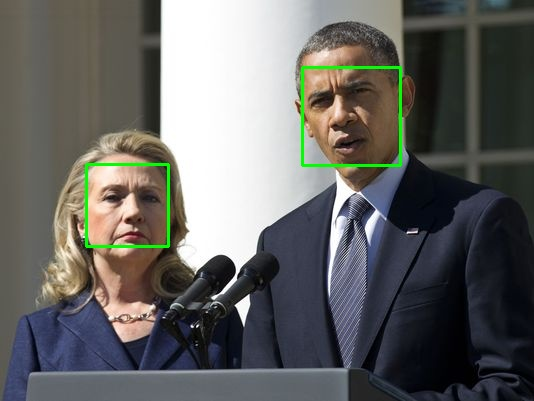
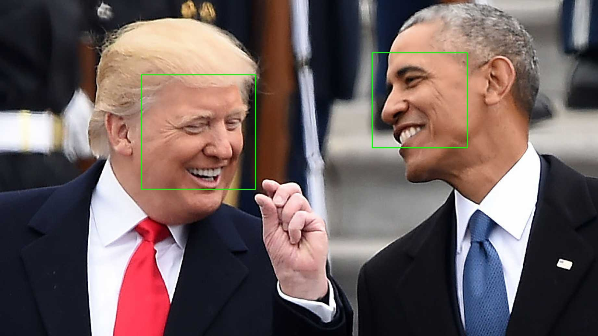

# faceID_lib

faceID_lib is built with python and dlib

## Dependencies
dlib

Opencv

Python 3.3+

## How to run
If you want to find the faces in the picture

```bash
cd $faceID_root
python3 examples/find_face_in_picture/find_faces_in_picture.py --input image_to_test --output output_image_with_face_rect
```





Search specific IDs with sample image in images folder

```bash
cd $faceID_root
mkdir examples/search_ID/output
python3 examples/search_ID/search.py --sample examples/search_ID/sample_clintion_trump.png --input examples/search_ID/input/ --output_folder examples/search_ID/output/ --cpus 1 --model cnn
```

The images that has matched the IDs in input will be save in 
```$faceID_root/examples/search_ID/output```

## Acknowledgments
Code partly borrows from [face_recognition](https://github.com/ageitgey/face_recognition)
